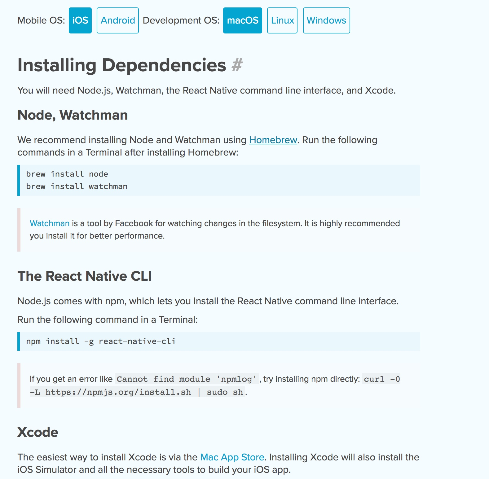
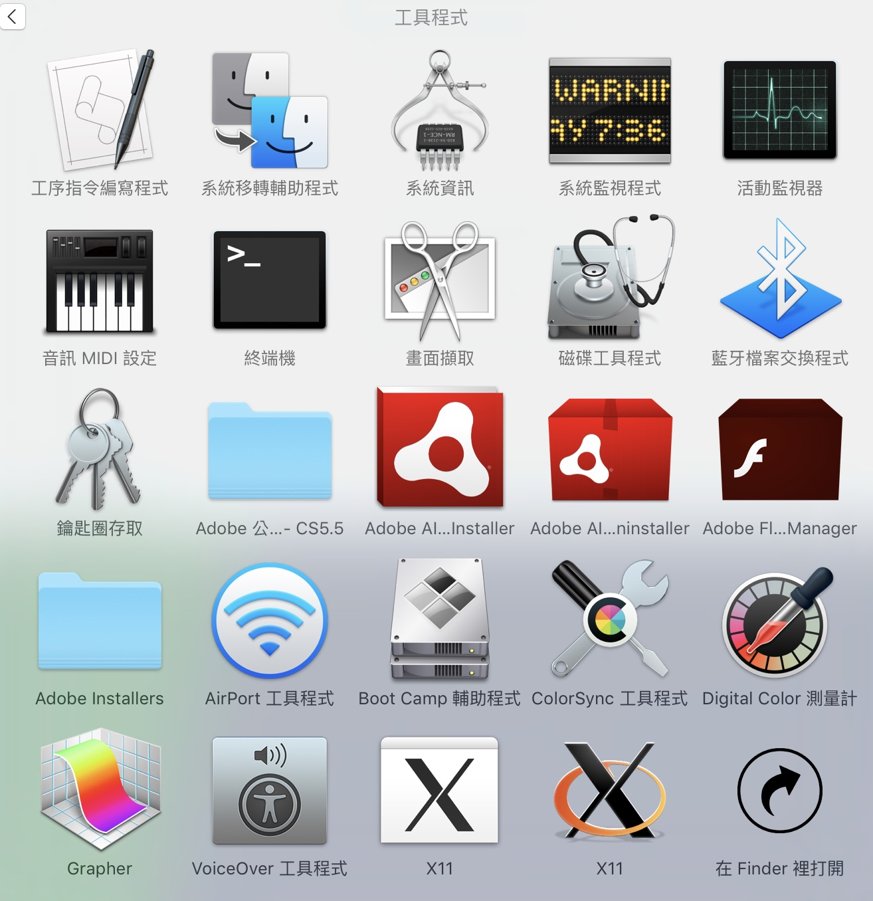
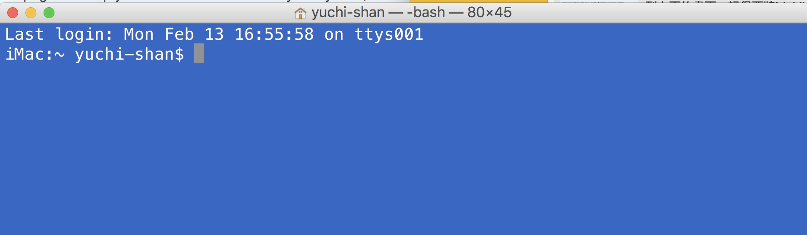
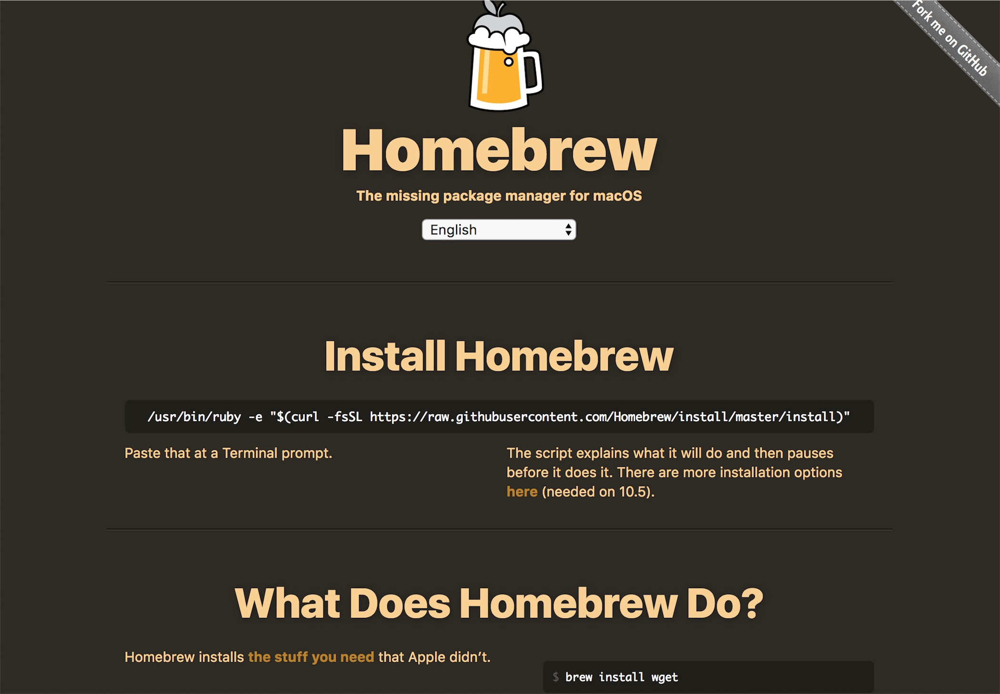
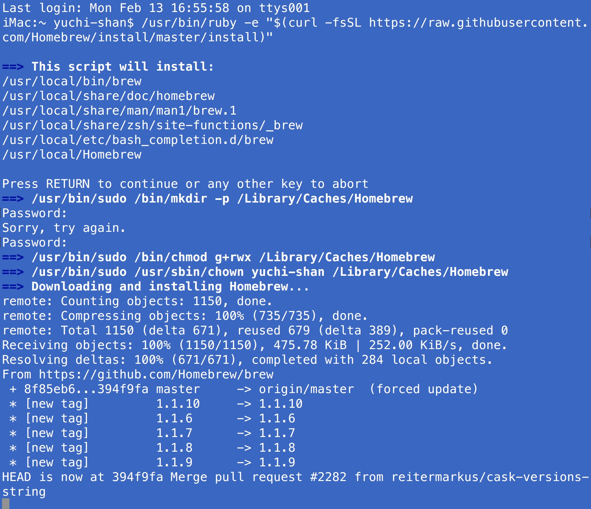
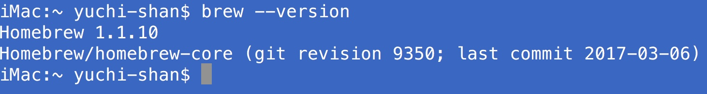
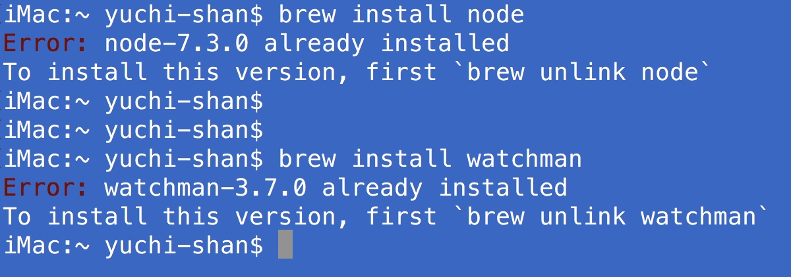
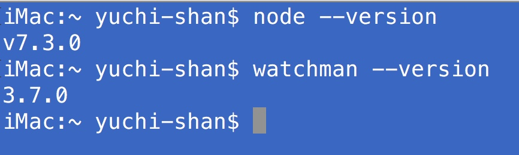
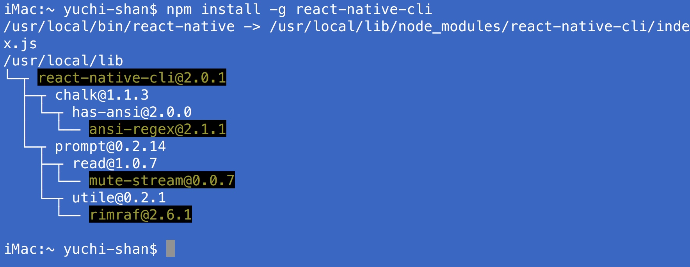
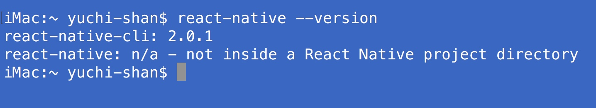

	Date:	2017年3月7日 GMT+8 下午3:17:04

MAC的React Native開發環境建立



請連結到React Native的[開發網址](https://facebook.github.io/react-native/docs/getting-started.html)，你會看到上面的畫面。記得要將Mobile OS選在iOS， 將Development OS選在macOS。





所有的安裝都是在MAC的終端機底下指令，你要先安裝[Homebrew](https://brew.sh/)。這是一個套件管理程式，我們用它來安裝node與watchman這兩個城市。其中，node要用來安裝react-native，watchman則是未來APP程式除錯的時候需要。

###  安裝HomeBrew



切換瀏覽器到homebrew的[網址](https://brew.sh/)，你會看到如上的畫面。注意中間那一行指令
```
/usr/bin/ruby -e "$(curl -fsSL https://raw.githubusercontent.com/Homebrew/install/master/install)"
```
把這一行指令複製，貼到你mac終端機，會出現如下畫面，稍等一下就安裝好homebrew，在安裝的過程，可能會要你輸入你在MAC登錄的帳號密碼



安裝完，你可以在終端機輸入```brew --version```確定是否安裝完成，如果安裝完成，就會出現版本號碼



### 安裝node與watchman
接下來，就直接在終端機畫面依序輸入```brew install node```與```brew install watchman```來安裝node與watchman這兩個程式。



在以上的畫面之中，因為這兩個程式我都安裝好了，所以會出現已安裝的訊息。安裝完之後，你可以輸入```node --version```與```watchman --version```觀察是否安裝完成



###  安裝react-native-cli
終於到最後步驟，這次，我們要使用node裡面的一個npm指令來安裝react native，npm也是一個程式的套件管理。你只要在命令列輸入```npm install -g react-native-cli``` 即可完成最後的安裝，這次的作業要的就是這個截圖



安裝完，也請你用```react-native --version```指令確定是否安裝完成



### 最後
作業已經完成，但是，請你確認一下你電腦的Xcode是否是最新版本，以及，請你啟動一下Xcode，因為第一次啟動Xcode的時候，系統還會幫你安裝一些東西，這些東西我們上課的時候會用到
